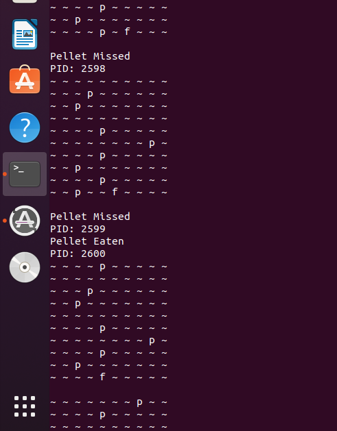

# Concurrent-Processing-and-Shared-Memory
CECS 326 Lab Fish, Pellets, & Swim Mill Lab.I n this project, we were suppose to create a program in which shared memory was used simulatenously, resulting in multi-threading & semaphores using virtual machine(Linux)
# There were three components:
  - **Fish**: One fish that tries to gather as much pellets as possible.
  - **Pellets**: Multiple pellets are dropped one grid space at a time.
  - **Swim Mill**: Enables everything to work together. Running this would run the entire program. 
 # Snapshot of how it works:
 
